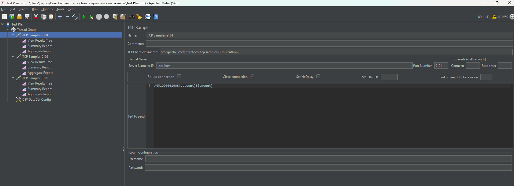

# JMeter Load Testing Guide for ATM Middleware (Spring MVC + TCP)

This document explains how to configure **Apache JMeter** to load test
the ATM middleware TCP socket listeners.

------------------------------------------------------------------------

## 1. Install JMeter (Windows)

1.  Download from: https://jmeter.apache.org/download_jmeter.cgi

2.  Extract the ZIP file.

3.  Run:
```bat
bin\jmeter.bat
```

No installation required.

------------------------------------------------------------------------

## 2. Create a Basic TCP Load Test Plan

### Step 1: Add Thread Group

Right click **Test Plan** → Add → Threads (Users) → Thread Group

Example configuration:

  Field               Value
  ------------------- ------------
  Number of Threads   50
  Ramp-Up Period      10 seconds
  Loop Count          100

What This Actually Means:
- 50 threads        : 50 virtual ATM machines are working at the same time.
- Ramp-Up 10 seconds: JMeter will not start all 50 at once. It will spread them over 10 seconds.
- Loop Count 100    : Each ATM will send 100 transactions.

So in total:
- 50 ATMs
- Each sends 100 transactions
- Total transactions = 50 × 100 = 5,000

How It Will Behave:
1. JMeter starts.
2. First ATM starts.
3. Then second.
4. Gradually all 50 start within 10 seconds.
5. Each one sends 100 requests to your socket.
6. When done, test finishes.

If You Want More Load:
* Increase Number of Threads  : more ATMs.
* Increase Loop Count         : more transactions per ATM.
* Reduce Ramp-Up              : stronger sudden load.

------------------------------------------------------------------------

### Step 2: Add TCP Sampler

Right click Thread Group → Add → Sampler → TCP Sampler

Configure:

  ------------------------------------------------------------------------------------------
  Field                               Value
  ----------------------------------- ------------------------------------------------------
  Server Name or IP:                  localhost

  Port Number:                        9101

  Timeout:                            10000

  Re-use connection:                  Unchecked

  Close connection:                   disabled (auto)

  TCPClient classname:                org.apache.jmeter.protocol.tcp.sampler.TCPClientImpl
  ------------------------------------------------------------------------------------------

------------------------------------------------------------------------

### Step 3: Add ISO Test Message

In **Text to send**, use:

    A4M1000002001234567890123456

Rules: - Must start with `A4M` - Should contain `0200` so dummy
middleware converts to `0210`

------------------------------------------------------------------------

## 3. Add Listeners (For Monitoring)

- TCP Sampler --> Add --> Listener --> View Results Tree
- TCP Sampler --> Add --> Listener --> Summary Report
- TCP Sampler --> Add --> Listener --> Aggregate Report

IMPORTANT: Disable "View Results Tree" during real load testing.

------------------------------------------------------------------------

## 4. Use Dynamic Data (Recommended)

Add: Right click Thread Group → Add → Config Element → CSV Data Set
Config

Create CSV file:

    account,amount
    1234567890,1000
    2234567890,2000
    3234567890,3000

Then message:

    A4M100000200${account}${amount}

------------------------------------------------------------------------

## 5. Load Multiple Ports

To simulate switch routing: - Add separate TCP Samplers for ports 9101,
9102, 9103 - Or use Random Controller

------------------------------------------------------------------------

## 6. Run in CLI Mode (Recommended for Real Load)

    jmeter -n -t atm-test.jmx -l result.jtl

Do NOT use GUI for heavy load.

------------------------------------------------------------------------

## 7. Monitor During Load

### Application Metrics

Open:

    http://localhost:8080/metrics

Monitor:

-   atm_socket_requests_total
-   atm_socket_active_connections
-   atm_socket_request_duration_seconds
-   atm_socket_sla_violations_total

------------------------------------------------------------------------

### Windows OS Monitoring

    netstat -ano | findstr 9101

------------------------------------------------------------------------

### Linux Monitoring

    ss -ant | grep 9101

------------------------------------------------------------------------

## 8. Recommended ATM Load Scenarios

### Baseline

-   20 threads
-   Normal traffic

### Branch Batch Simulation

-   200 threads
-   Ramp-up 5 sec

### Stress Test

Increase threads until: - Active connections reach maxConnections - SLA
violations increase - CPU \> 80%

------------------------------------------------------------------------

## 9. Important TCP Notes

Because the application reads until socket timeout:

In TCP Sampler: - Enable "Close connection" - Timeout \>= 10000 - Avoid
adding CRLF unless framing is modified

------------------------------------------------------------------------

## 10. Measuring TPS

### In JMeter

Use Aggregate Report → Throughput column

### In Prometheus

    rate(atm_socket_requests_total[1m])

------------------------------------------------------------------------

## Recommended Professional Setup

During testing, monitor:

-   TPS
-   p95 latency
-   Active connections
-   Error rate
-   CPU
-   JVM memory

------------------------------------------------------------------------

End of Guide.
