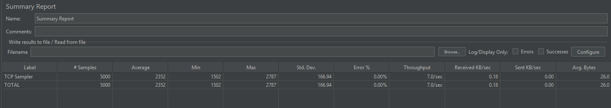
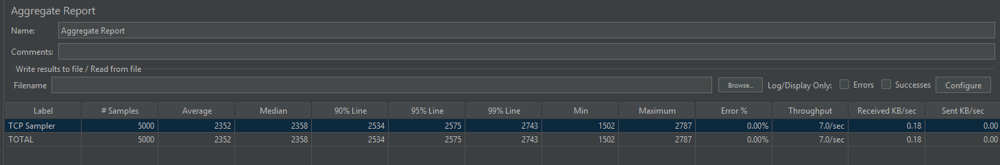

# Understanding JMeter Summary Report and Aggregate Report (Simple Explanation)

This document explains, in very simple language, how to understand the
**Summary Report** and **Aggregate Report** from JMeter.

The example here is based on testing **Port 9101** of your ATM
middleware.

------------------------------------------------------------------------

# Part 1 -- Understanding the Summary Report

Your Summary Report showed:

-   5000 Samples
-   Average ≈ 2352 ms
-   Min ≈ 1502 ms
-   Max ≈ 2787 ms
-   Std Dev ≈ 166 ms
-   Error % = 0.00%
-   Throughput = 7.0 / sec

Let us understand what each one means.

------------------------------------------------------------------------

## \# Samples = 5000

This means:

JMeter sent **5000 total requests** to your socket port.

If you had: - 50 threads - Loop count 100

Then:

50 × 100 = 5000 requests

So the test completed correctly.

------------------------------------------------------------------------

## Average = 2352 ms

Each request took about **2.3 seconds** on average.

That means: If a customer sends a transaction, usually the system
responds in around 2--3 seconds.

If your SLA is 10 seconds, then this is very safe.

------------------------------------------------------------------------

## Min = 1502 ms

The fastest request took 1.5 seconds.

This is the best case response time.

------------------------------------------------------------------------

## Max = 2787 ms

The slowest request took about 2.8 seconds.

Important point: The slowest request is still far below 10 seconds.

That means there were no timeouts or serious delays.

------------------------------------------------------------------------

## Std. Dev. = 166 ms

This shows how much the response time changes.

Small number = stable system.

Since 166 ms is small compared to 2352 ms average, the system is stable.

If this number was very large, it would mean response times are
unpredictable.

------------------------------------------------------------------------

## Error % = 0.00%

Very important for banking systems.

It means: - No timeouts - No failed connections - No broken responses

System handled all requests successfully.

------------------------------------------------------------------------

## Throughput = 7.0 / sec

This means the system processed:

7 transactions per second.

This is your actual load achieved during this test.

------------------------------------------------------------------------

# Part 2 -- Understanding the Aggregate Report

Aggregate Report gives more details than Summary Report.

Your numbers:

-   Average = 2352 ms
-   Median ≈ 2358 ms
-   90% Line ≈ 2534 ms
-   95% Line ≈ 2575 ms
-   99% Line ≈ 2743 ms
-   Max ≈ 2787 ms
-   Error % = 0%

Let us understand these in simple terms.

------------------------------------------------------------------------

## Median = 2358 ms

Median means:

Half of the requests finished in less than 2358 ms.

Since Median is almost equal to Average, the system is very consistent.

------------------------------------------------------------------------

## 90% Line = 2534 ms

90% of all transactions finished within 2.5 seconds.

Only 10% took longer than that.

This shows strong stability.

------------------------------------------------------------------------

## 95% Line = 2575 ms

95% of all transactions finished within 2.57 seconds.

In banking, 95% value is very important.

This means almost all customers get response in under 3 seconds.

------------------------------------------------------------------------

## 99% Line = 2743 ms

99% of requests completed within 2.74 seconds.

This means even rare slow requests are still very fast.

There are no big spikes or extreme delays.

------------------------------------------------------------------------

## Max = 2787 ms

The absolute slowest request was 2.78 seconds.

Notice something important:

99% value (2743 ms) is very close to Max (2787 ms).

That means there are no hidden extreme slow requests.

System is very stable.

------------------------------------------------------------------------

# What Does All This Tell You?

Under this load:

-   System is stable
-   No failures
-   No timeouts
-   No resource exhaustion
-   Response time is consistent
-   Fully inside 10 second SLA

This is a healthy system result.

------------------------------------------------------------------------

# What Should You Do Next?

To find system limit:

Increase threads gradually:

-   50 → 100 → 200 → 400

Watch:

-   Does Throughput increase?
-   Does Error % start increasing?
-   Does 95% or 99% jump higher?
-   Does Max get close to 10 seconds?

When these start rising quickly, you have reached system capacity.

------------------------------------------------------------------------

# Simple Conclusion

Your current test result shows:

The system can handle this load comfortably.

Now the next step is to slowly increase load and find the breaking
point.

------------------------------------------------------------------------

End of document.
