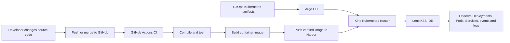

# Session 8 — Kubernetes Resources, Lens and Harbor CI Foundations

## Session purpose

Session 8 introduces the core concepts and tools that must be understood before building a complete Kubernetes CI/CD and GitOps workflow.

This session is intentionally a **foundation and preparation session**. It gives a short overview of:

1. Native Kubernetes API resources
2. Lens K8S IDE terms, menus and common options
3. Harbor as a private container registry
4. A working GitHub Actions example that builds and publishes an application image to Harbor

In the next session, these concepts will be connected in a complete demonstration using:

- GitHub Actions for Continuous Integration
- Harbor for container image storage
- Argo CD for GitOps-based Continuous Delivery
- Kind for the local Kubernetes cluster
- Lens for visual observation and troubleshooting

---

## Learning outcomes

After completing Session 8 and its preparation tasks, you should be able to:

- Recognize the purpose of common native Kubernetes API resources.
- Read the basic structure of a Kubernetes YAML manifest.
- Navigate the important areas of Lens K8S IDE.
- Explain the difference between a Harbor user account and a robot account.
- Create a Harbor project and configure access to it.
- Explain how GitHub Actions builds, tests and publishes a Docker image.
- Locate a published image and its tags in Harbor.
- Understand the responsibilities of GitHub Actions, Harbor, Argo CD, Kind and Lens in the upcoming CI/CD demonstration.

---

## Session materials

| No. | Resource | Purpose |
|---|---|---|
| 1 | [Native Kubernetes API Resources Briefing](./1.%20Native%20Kubernetes%20API%20Resources%20Briefing.pdf) | Introduces common Kubernetes resources, their real-life analogies, benefits and YAML examples. |
| 2 | [Lens K8S IDE Terms Explained](./2.%20Lens%20K8S%20IDE%20Terms%20Explained.pdf) | Explains common Lens menus, resource views, terms and troubleshooting options. |
| 3 | [Demo Harbor](https://demo.goharbor.io/) | Public Harbor environment for learning project, user, robot-account and image-management concepts. |
| 4 | [si-demo-harbor-image-push](https://github.com/AmjadHossainRahat/si-demo-harbor-image-push) | Spring Boot demonstration repository with local scripts, Docker packaging and GitHub Actions publication to Harbor. |

---

# 1. Native Kubernetes API resources

Kubernetes is controlled through API resources. A YAML file describes the desired state, and Kubernetes continuously works to make the cluster match that desired state.

A basic manifest normally contains:

```yaml
apiVersion: apps/v1
kind: Deployment

metadata:
  name: sample-api

spec:
  replicas: 2
```

The most important fields to recognize are:

| Field | Meaning |
|---|---|
| `apiVersion` | The Kubernetes API group and version used by the resource. |
| `kind` | The type of Kubernetes resource being created. |
| `metadata` | The resource identity, such as its name, namespace, labels and annotations. |
| `spec` | The desired configuration declared by the user. |
| `status` | The current state reported by Kubernetes after the resource is created. |

## Resource groups to remember

### Fundamental resources

Examples include:

- Pod
- Namespace
- ConfigMap
- Secret

These resources provide the basic building blocks, configuration and isolation used by applications.

### Workload resources

Examples include:

- Deployment
- ReplicaSet
- StatefulSet
- DaemonSet
- Job
- CronJob

These resources control how application workloads are created, replicated, updated or scheduled.

### Networking resources

Examples include:

- Service
- Ingress
- NetworkPolicy

These resources provide stable access, routing and communication control for workloads.

### Storage resources

Examples include:

- PersistentVolume
- PersistentVolumeClaim
- StorageClass

These resources allow applications to request and use persistent storage independently of individual Pods.

### Security and access resources

Examples include:

- ServiceAccount
- Role
- ClusterRole
- RoleBinding
- ClusterRoleBinding

These resources define application identities and control what users or workloads are permitted to do.

> Do not try to memorize every YAML field. First understand the responsibility of each resource and how resources are connected.

---

# 2. Lens K8S IDE overview

Lens provides a graphical interface for viewing and interacting with Kubernetes clusters.

It does not replace Kubernetes or `kubectl`. It uses the same Kubernetes API and the permissions available through the selected kubeconfig context.

## Important areas to explore

| Lens area | What to observe |
|---|---|
| Cluster overview | Cluster health, resource utilization and visible problems |
| Nodes | Worker/control-plane nodes, capacity, conditions and allocated resources |
| Workloads | Pods, Deployments, ReplicaSets, StatefulSets, DaemonSets, Jobs and CronJobs |
| Network | Services, Endpoints, Ingresses and NetworkPolicies |
| Configuration | ConfigMaps, Secrets, resource quotas and related configuration |
| Storage | PersistentVolumes, PersistentVolumeClaims and StorageClasses |
| Access control | ServiceAccounts, Roles, ClusterRoles and bindings |
| Events | Recent cluster activities, scheduling errors and warning messages |
| Pod logs | Application output and runtime errors |
| Pod shell | Interactive terminal access inside a running container |
| Port forwarding | Temporary access from the local computer to a Kubernetes workload |
| Resource YAML | The complete Kubernetes representation of the selected resource |

## Beginner troubleshooting path

When an application is not working, use this order:

1. Check whether the Deployment is available.
2. Check whether the expected Pods exist.
3. Check the Pod status and restart count.
4. Read the Pod events.
5. Read the container logs.
6. Check the Service and its selector.
7. Check whether the Service has endpoints.
8. Confirm the container image name and tag.
9. Inspect ConfigMaps, Secrets and environment variables.
10. Use the Lens terminal or `kubectl` to confirm the same information.

---

# 3. Harbor overview

Harbor is an OCI-compatible container registry used to store and manage container images and related artifacts.

For this training, we use:

[https://demo.goharbor.io/](https://demo.goharbor.io/)

The main concepts are:

| Harbor concept | Purpose |
|---|---|
| User account | Human identity used to sign in to the Harbor UI. |
| Project | Logical boundary containing repositories, members, robot accounts and policies. |
| Project member | A Harbor user who has been assigned a role inside a project. |
| Repository | Collection of related container image artifacts. |
| Artifact | A particular stored image manifest and its metadata. |
| Tag | Human-readable reference such as `main` or `sha-abc123`. |
| Digest | Immutable content identifier such as `sha256:...`. |
| Robot account | Non-human credential used by CI/CD systems and automation. |

## Important distinction

A **user account** is for a person.

A **robot account** is for automation such as GitHub Actions.

A robot account should not be treated as a normal interactive user and should receive only the permissions required by its job.

---

# 4. Demonstration repository

Repository:

[https://github.com/AmjadHossainRahat/si-demo-harbor-image-push](https://github.com/AmjadHossainRahat/si-demo-harbor-image-push)

The repository contains a minimal Spring Boot REST API created to demonstrate this flow:

```text
Push to main
    |
    v
GitHub Actions
    |
    +--> Validate, compile, test and package
    |
    +--> Build Docker image
    |
    +--> Push immutable commit-SHA tag to Harbor
    |
    +--> Pull the exact published digest
    |
    +--> Run a smoke test
    |
    +--> Publish/promote the verified main tag
```

## Important repository areas

| Path | Purpose |
|---|---|
| `src/` | Spring Boot application and automated tests |
| `pom.xml` | Maven project configuration and dependencies |
| `Dockerfile` | Instructions for packaging the application as a container image |
| `.dockerignore` | Files excluded from the Docker build context |
| `.github/workflows/ci-harbor.yml` | GitHub Actions CI and Harbor publication workflow |
| `.github/dependabot.yml` | Automated dependency update configuration |
| `scripts/00-check-prerequisites.ps1` | Verifies required local tools |
| `scripts/01-run-tests.ps1` | Runs the Maven tests |
| `scripts/02-build-image.ps1` | Builds the Docker image locally |
| `scripts/03-run-container.ps1` | Starts the application container |
| `scripts/04-test-api.ps1` | Calls the sample API and verifies the response |
| `scripts/05-stop-container.ps1` | Stops and removes the local container |
| `scripts/06-push-manually.ps1` | Demonstrates a manual Harbor image push |

## Demonstration API

```http
GET /api/hello
```

Example response:

```json
{
  "message": "Hello from si-demo-harbor-image-push!",
  "version": "local",
  "timestamp": "2026-07-25T12:00:00Z"
}
```

The application intentionally has no authentication, database or business layer. This keeps the training focused on build, container, registry and delivery concepts.

---

# Preparation before the next session

Complete the following tasks before attending the full CI/CD and GitOps demonstration.

---

## Task 1 — Review the Kubernetes API resource presentation

Read:

[Native Kubernetes API Resources Briefing](./1.%20Native%20Kubernetes%20API%20Resources%20Briefing.pdf)

While reviewing, make sure you can answer these questions:

- What is a Kubernetes API resource?
- What are `apiVersion`, `kind`, `metadata` and `spec`?
- What is the difference between a Pod and a Deployment?
- Why is a Service required when Pods can be replaced?
- What is the difference between a ConfigMap and a Secret?
- What is the relationship between a PersistentVolume and a PersistentVolumeClaim?
- What is the difference between a Role and a RoleBinding?
- Which resources are namespaced and which can be cluster-scoped?
- Why should application configuration be separated from the container image?

### Completion check

- [ ] I can identify the `kind` of a Kubernetes YAML manifest.
- [ ] I can explain the purpose of a Pod, Deployment and Service.
- [ ] I understand that Kubernetes manages desired state.
- [ ] I understand that Pods are replaceable and should not be treated as permanent servers.
- [ ] I understand why RBAC resources are required.

---

## Task 2 — Explore Lens terminology

Read:

[Lens K8S IDE Terms Explained](./2.%20Lens%20K8S%20IDE%20Terms%20Explained.pdf)

Focus on:

- Cluster and kubeconfig context
- Namespace selection
- Nodes and workloads
- Pod status and restarts
- Events and logs
- Service and endpoint relationships
- Resource YAML
- Port forwarding
- Pod shell
- Resource deletion and editing risks

### Completion check

- [ ] I can select a cluster and namespace in Lens.
- [ ] I can locate Deployments, Pods and Services.
- [ ] I can open Pod logs and events.
- [ ] I can inspect the YAML of a Kubernetes resource.
- [ ] I understand that Lens actions affect the actual cluster.
- [ ] I understand that production access must follow RBAC and least privilege.

---

## Task 3 — Create and configure a Harbor project

Open:

[https://demo.goharbor.io/](https://demo.goharbor.io/)

### 3.1 Create your personal account

1. Open the Harbor demo site.
2. Select **Sign Up**.
3. Register a personal training account.
4. Sign in with the newly created account.

Use this account for interactive access to the Harbor UI.

### 3.2 Create a project

1. Open **Projects**.
2. Select **New Project**.
3. Enter a unique project name.

Suggested naming pattern:

```text
<your-name>-session-8
```

Example:

```text
rahat-session-8
```

4. Keep the project private unless the exercise specifically requires public access.
5. Create the project.
6. Open the project and explore:

   - Summary
   - Repositories
   - Members
   - Robot Accounts
   - Logs
   - Configuration

### 3.3 Practice project membership

A normal project owner generally does not create arbitrary Harbor users directly. Another user must already exist in the Harbor instance.

To practise membership:

1. Ask another participant to register a Harbor account, or create a separate test account using another browser profile.
2. Open your Harbor project.
3. Open **Members**.
4. Add the other Harbor username.
5. Assign only the role required for the exercise.

Recommended training roles:

| Requirement | Suggested role |
|---|---|
| View and pull artifacts only | Guest or Limited Guest |
| Push images to the project | Developer |
| Manage repositories and selected project operations | Maintainer |
| Manage members, robots and project configuration | Project Admin |

Do not grant **Project Admin** unless the user actually needs administrative control.

### 3.4 Create a project robot account

1. Open your project.
2. Open **Robot Accounts**.
3. Select **New Robot Account**.
4. Use a meaningful name, for example:

```text
github-actions
```

5. Grant only the permissions required by the pipeline:

   - Repository Pull
   - Repository Push

6. Do not grant delete, administration or unrelated permissions.
7. Create the robot account.
8. Immediately copy or download:

   - Robot username
   - Robot secret

9. Store the credentials securely.

> Never commit the robot secret to source control, documentation, screenshots, chat messages or application configuration.

### Completion check

- [ ] I created a Harbor user account.
- [ ] I created a uniquely named project.
- [ ] I explored the project menus.
- [ ] I added or reviewed a normal project member.
- [ ] I created a project-scoped robot account.
- [ ] The robot account has pull and push permissions only.
- [ ] I securely stored the robot username and secret.

---

## Task 4 — Explore and preferably implement the demo repository

Reference repository:

[https://github.com/AmjadHossainRahat/si-demo-harbor-image-push](https://github.com/AmjadHossainRahat/si-demo-harbor-image-push)

The preferred exercise is to implement the same flow in your own GitHub repository rather than only reading the reference repository.

### Option A — Fork or copy the reference repository

1. Fork the repository to your GitHub account, or create a new repository and copy the project.
2. Keep the repository free of Harbor passwords and robot secrets.
3. Review the application, tests, Dockerfile, scripts and GitHub Actions workflow.

### Option B — Implement the flow in an existing application

Your repository should contain at least:

- Application source code
- Automated test
- Dockerfile
- `.dockerignore`
- GitHub Actions workflow
- Health or test endpoint
- README explaining the local and CI flow

### Configure the GitHub repository

Open:

```text
GitHub repository
  -> Settings
  -> Secrets and variables
  -> Actions
```

Create this repository variable:

```text
HARBOR_PROJECT=<your-harbor-project-name>
```

Create these repository secrets:

```text
HARBOR_USERNAME=<robot-account-username>
HARBOR_PASSWORD=<robot-account-secret>
```

Do not use your personal Harbor password when a properly scoped robot account is available.

### Understand the workflow behavior

The reference workflow responds to:

- Pull requests targeting `main`
- Pushes to `main`
- Manual `workflow_dispatch` execution

For a pull request, it verifies the application but does not publish an image using Harbor credentials.

For a successful push to `main`, it:

1. Checks out the source.
2. Sets up Java and Maven caching.
3. Validates the Maven project.
4. Compiles the application.
5. Runs automated tests.
6. Packages and verifies the application.
7. Validates the Harbor configuration.
8. Generates complete image references.
9. Authenticates to Harbor.
10. Builds the Docker image.
11. Pushes an immutable commit-SHA tag.
12. Resolves the published digest.
13. Pulls the exact digest from Harbor.
14. Runs a smoke-test container.
15. Calls the application endpoint.
16. Pushes the verified `main` tag.
17. Confirms that `main` points to the tested digest.
18. Writes a publication summary in GitHub Actions.

### Expected image references

```text
demo.goharbor.io/<project>/<repository>:sha-<full-commit-sha>
demo.goharbor.io/<project>/<repository>:main
```

Example:

```text
demo.goharbor.io/rahat-session-8/si-demo-harbor-image-push:sha-abc123...
demo.goharbor.io/rahat-session-8/si-demo-harbor-image-push:main
```

### Run locally on Windows PowerShell

```powershell
Set-ExecutionPolicy -Scope Process Bypass

./scripts/00-check-prerequisites.ps1
./scripts/01-run-tests.ps1
./scripts/02-build-image.ps1
./scripts/03-run-container.ps1
./scripts/04-test-api.ps1
```

Stop the local container:

```powershell
./scripts/05-stop-container.ps1
```

The manual Harbor push script is available for learning purposes:

```powershell
./scripts/06-push-manually.ps1
```

The GitHub Actions workflow remains the preferred automated approach.

### Completion check

- [ ] I can explain the difference between the `verify` and `publish` jobs.
- [ ] I understand why pull requests do not receive Harbor credentials.
- [ ] I configured the `HARBOR_PROJECT` repository variable.
- [ ] I configured the Harbor robot username and secret as GitHub secrets.
- [ ] My GitHub Actions workflow completed successfully.
- [ ] I found the complete image name in the Actions job summary.
- [ ] I found the repository and image tags in Harbor.
- [ ] I can identify the immutable commit-SHA tag.
- [ ] I can identify the movable `main` tag.
- [ ] I understand why the smoke test runs before `main` is promoted.

---

# What will happen in the next session

The next session will connect the CI pipeline to a Kubernetes GitOps delivery workflow.



## Tool responsibilities

| Tool | Primary responsibility |
|---|---|
| GitHub | Stores application source and Kubernetes configuration. |
| GitHub Actions | Validates source, runs tests, builds the image and publishes it to Harbor. |
| Harbor | Stores versioned container images and provides registry credentials and policies. |
| Argo CD | Compares the desired Kubernetes configuration in Git with the live cluster and synchronizes changes. |
| Kind | Runs the local Kubernetes cluster used for the demonstration. |
| Lens | Provides a visual interface for inspecting and troubleshooting the cluster. |

## Important mental model

```text
GitHub Actions builds and publishes the application artifact.

Argo CD deploys the desired Kubernetes configuration.

Harbor stores the container image.

Kubernetes runs the application.

Lens helps humans observe and troubleshoot it.
```

Argo CD does not normally build the source code.

Lens does not normally perform the CI pipeline.

Harbor does not deploy the application by itself.

Each tool has a separate responsibility.

---

# Security reminders

- Never commit Harbor passwords or robot secrets to Git.
- Use GitHub Actions secrets for sensitive values.
- Prefer project-scoped robot accounts over personal user credentials.
- Apply least-privilege permissions.
- Treat kubeconfig files as sensitive access credentials.
- Do not expose Kubernetes Secrets in screenshots or logs.
- Do not use the public Harbor demo for confidential or production images.
- Expect public demo data and accounts to be temporary.
- Use immutable image tags or digests for reliable deployment traceability.
- Do not depend only on the movable `main` tag for production rollback or auditing.

---

# Scope of Session 8

Session 8 provides the conceptual and practical foundation for the next demonstration.

It does **not** yet attempt to provide:

- A production Kubernetes cluster
- Production RKE2 installation
- High availability
- Production Harbor deployment
- Production secret management
- Enterprise monitoring and alerting
- A complete rollback strategy
- A production-grade release approval process

Those concerns require additional architecture, security, operational and infrastructure decisions beyond this local learning exercise.

---

# Final readiness checklist

Before the next session, confirm that:

- [ ] I reviewed the Native Kubernetes API Resources presentation.
- [ ] I reviewed the Lens terminology presentation.
- [ ] I created and explored a Harbor project.
- [ ] I understand users, members and robot accounts.
- [ ] I created a least-privilege robot account for CI.
- [ ] I explored or implemented the Harbor image-push repository.
- [ ] I configured GitHub repository variables and secrets.
- [ ] I successfully published an image to Harbor.
- [ ] I found both the commit-SHA tag and the `main` tag.
- [ ] I understand the role of GitHub Actions, Harbor, Argo CD, Kind and Lens.

When all items are complete, you are ready for the complete CI/CD and GitOps demonstration.
