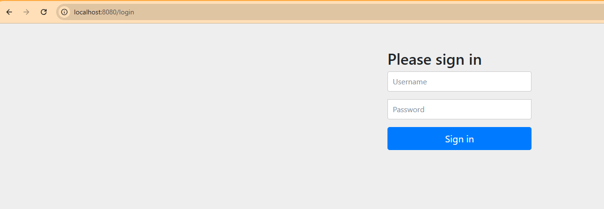
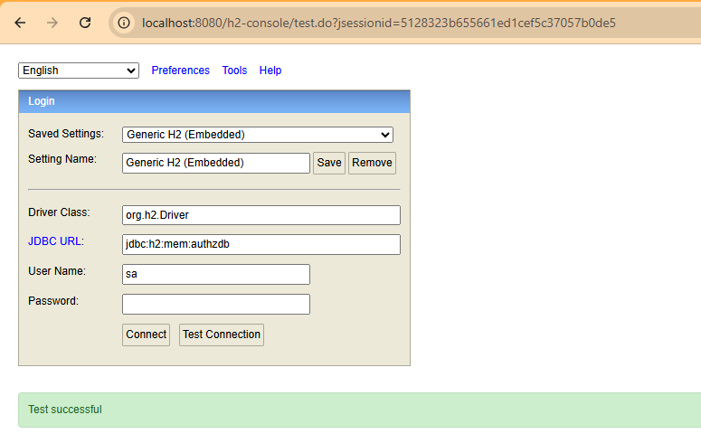
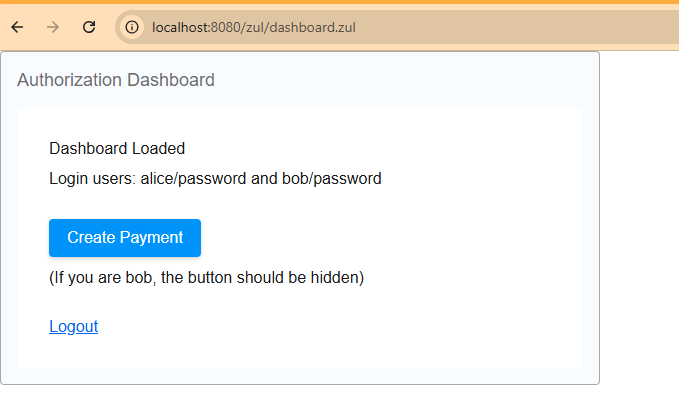
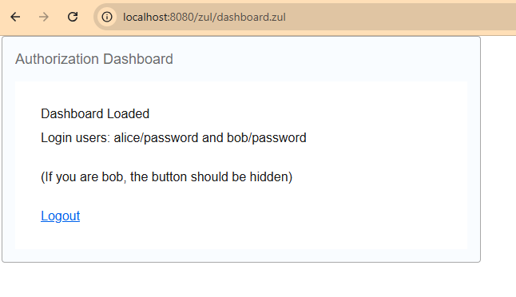
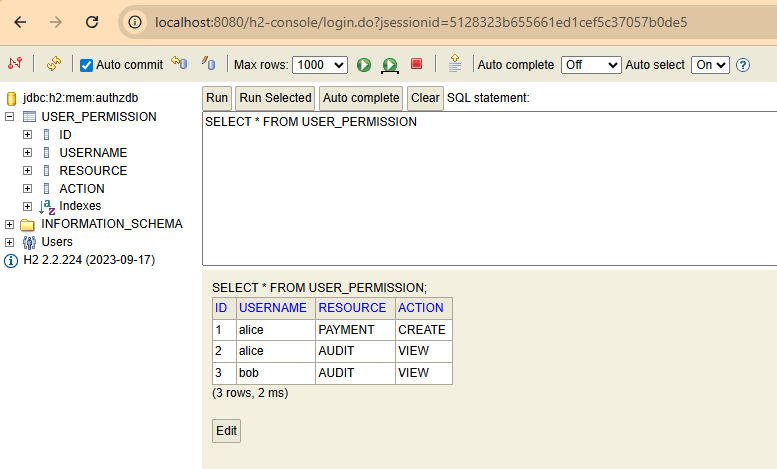
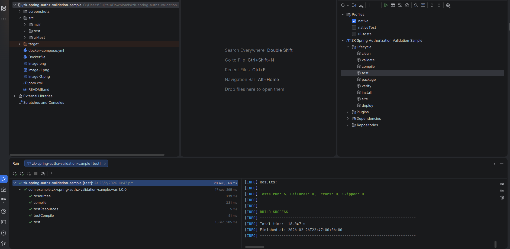
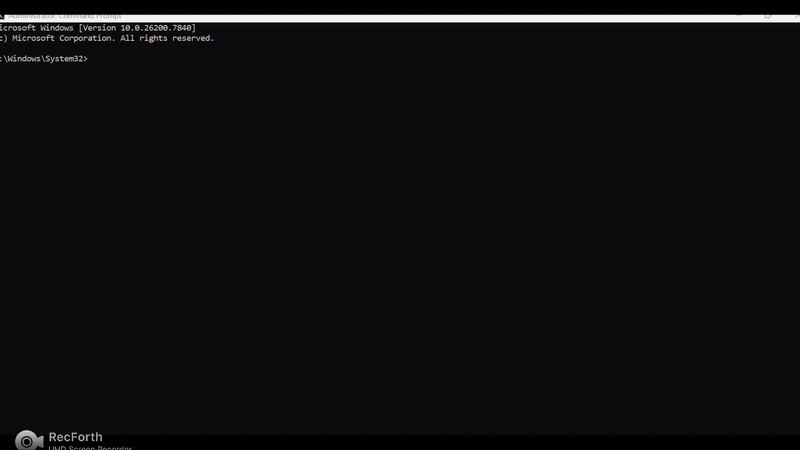
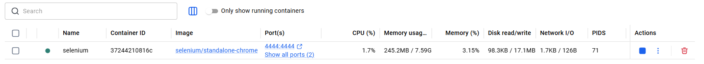

# ZK + Spring Security Authorization Validation Sample

A minimal, testable reference project for **authorization validation** in a **Spring Boot + Spring Security + ZK** application.

## What this project shows

- **Authentication**: Spring Security form login
- **Fixed application role**: every authenticated user receives `ROLE_APP_USER`
- **Authorization**: fine‑grained permissions stored in DB table `user_permission`
- **Backend enforcement**: `@PreAuthorize("hasPermission('RESOURCE','ACTION')")` via a custom `PermissionEvaluator`
- **UI enforcement** (ZK): `dashboard.zul` shows/hides **Create Payment** based on DB permission
- **Automated validation**:
  - Unit tests (guard logic)
  - Integration tests (MockMvc REST authorization)
  - UI tests (Selenium) for ZK page behavior

## Requirements

- Java 17
- Maven 3.9+

## Run the application

### Bash (Git Bash / WSL) / Windows CMD

```bash
mvn clean spring-boot:run
```


Open:

- Home: http://localhost:8080/
- ZK dashboard: http://localhost:8080/zul/dashboard.zul
- H2 console: http://localhost:8080/h2-console

### H2 console connection

- JDBC URL: `jdbc:h2:mem:authzdb`
- User: `sa`
- Password: *(blank)*


## Demo users

- `alice` / `password` → has `PAYMENT/CREATE`
- 
- `bob` / `password` → does **not** have `PAYMENT/CREATE`
- 

Seed data: `src/main/resources/data.sql`
- 

## Run unit + integration tests

```bash
mvn clean test
```


## Run UI tests (Selenium)

UI tests are **not** part of the default test source set.
They live in `src/ui-test/java` and run only with the `ui-tests` Maven profile.

When `-Pui-tests` is enabled, the build is configured to:

- **skip** unit/integration tests (Surefire)
- run UI tests via **Failsafe** on `verify`

### Option A — Local Chrome (visible by default)

1) Start the app:

```bash
mvn clean spring-boot:run
```

2) Run UI tests:

**CMD**
```bash
mvn -Pui-tests -Dapp.baseUrl=http://localhost:8080 verify
```



Notes:
- Local UI runs are **visible by default** so you can watch the steps.
- For headless local runs (CI-like): add `-Dui.headless=true`.

### Option B — Selenium Remote (Docker)

Start Selenium (includes a web UI + noVNC):

```bash
docker run -d --name selenium -p 4444:4444 -p 7900:7900 selenium/standalone-chrome
```


- WebDriver endpoint: `http://localhost:4444/wd/hub`
- noVNC (watch browser): http://localhost:7900/ *(password is usually `secret` depending on image)*

Start the app locally:

```bash
mvn clean spring-boot:run
```

Run UI tests against the container:

**CMD**
```bash
mvn -Pui-tests -Dui.driver=remote -Dui.remoteUrl=http://localhost:4444/wd/hub -Dapp.baseUrl=http://host.docker.internal:8080 verify
```

## Implementation summary

- All users authenticate via `InMemoryUserDetailsManager` and receive `ROLE_APP_USER`.
- Authorization checks use `DbPermissionEvaluator` → `PermissionService` → `user_permission`.
- ZK `DashboardComposer` consults an `AuthorizationGuard` to hide/remove actions for unauthorized users.

## Notes

- `schema.sql` is idempotent (`IF NOT EXISTS`) to support restarts.
- For production systems, replace SQL init scripts with Flyway/Liquibase migrations.
